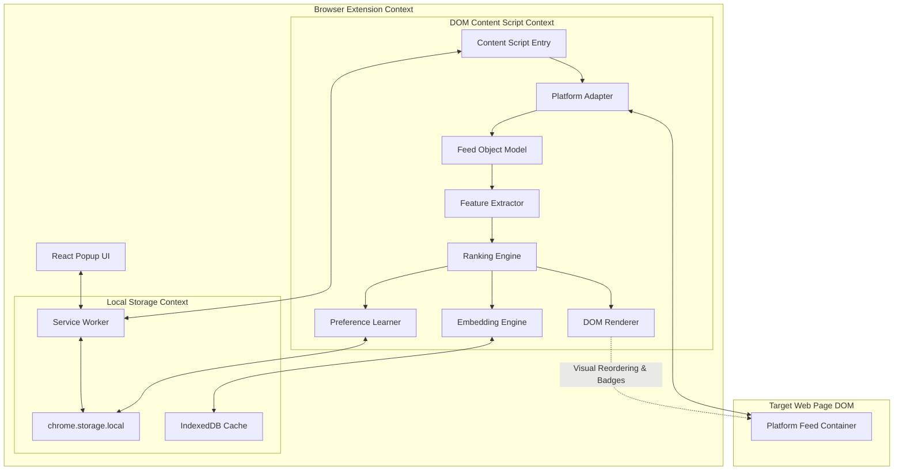

# FeedForge System Architecture

This document describes the high-level system design and architecture of FeedForge.

## Component Overview

FeedForge is a local-first browser extension designed with a modular architecture.

## Detailed Layer Description

### 1. Platform Adapter Layer
Platform adapters (e.g. [InstagramAdapter](file:///c:/Users/nikil/Desktop/FeedForge/src/content/adapters/instagram.adapter.ts)) isolate all page-specific selectors, structural DOM trees, and mutation events. They normalize raw page elements into standard Feed Objects.

### 2. Feed Object Model (FOM) & Feature Extraction
Normalizes post metadata like caption text, author name, timestamp, and image alternative text, and estimates reading times.

### 3. Local Embedding Engine
Uses `Transformers.js` to run the `Xenova/all-MiniLM-L6-v2` ONNX model directly inside the browser. It maps text to 384-dimensional dense vectors to measure semantic similarity with the user's active goals. Computed embeddings are cached in IndexedDB to prevent redundant computations.

### 4. Goal-Based Ranking Engine
Computes a customized, multi-objective score for every post:
`Score = Goal Alignment + Semantic Similarity + User Preference + Freshness + Diversity - Distraction Score`
Weights are dynamically computed based on user settings and priorities.

### 5. DOM Renderer
Injected script that visually adjusts the local view:
- Adds a score badge on the post.
- Highlights high-scoring items with a subtle accent glow.
- Dim or hide low-scoring/distracting items.
- Reorders the posts in the feed container.

### 6. Background Service Worker
Manages the lifetime, event routing, profile export/import, settings state, and coordinate actions between UI popup tabs and the injected content script.
